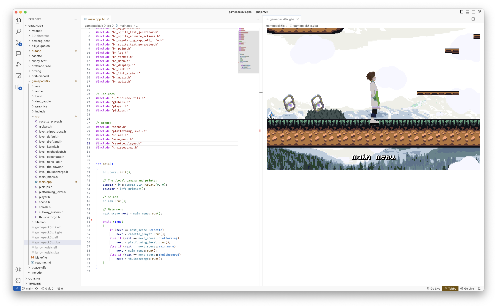

# NDS/GBA Emulator for VSCode

This is a simple Nintendo DS and GameBoy Advance Emulator for VSCode. It embeds [desmond](https://github.com/js-emulators/desmond/tree/main), a web-based NDS Emulator based on [DeSmuME](https://desmume.org/), and [mGBA](https://mgba.io/).

## Usage
Simply open a .nds or .gba file in VSCode. You can drag the tab to different places like any other view.
The emulator will refresh when the rom changes on the filesystem.

Make sure the tab is selected (a colored outline on top) for the keyboard input to work.

### Controls for GBA
| GBA     | PC        |
|---------|-----------|
| A       | X         |
| B       | Z         |
| L       | A         |
| R       | S         |
| Start   | Return    |
| Select  | Backspace |

### Controls for NDS
| NDS     | PC        |
|---------|-----------|
| A       | X         |
| B       | Z         |
| X       | S         |
| Y       | A         |
| L       | Q         |
| R       | W         |
| Start   | Return    |
| Select  | Tab       |
