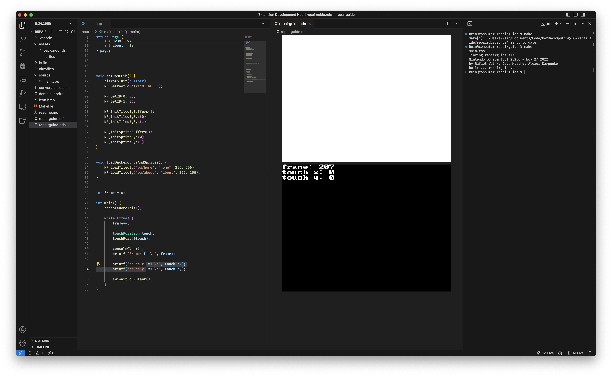

# NDS/GBA Emulator for VSCode

This is a simple NDS Emulator for VSCode. It embeds [desmond](https://github.com/js-emulators/desmond/tree/main), a web-based NDS Emulator based on [DeSmuME](https://desmume.org/), and [mGBA](https://mgba.io/).

## Usage
Simply open a .nds or .gba file in VSCode. You can drag the tab to different places like any other view.
The emulator will refresh when the rom changes on the filesystem.